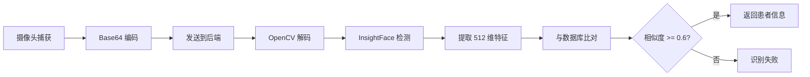

# 人脸识别功能使用指南

## 📋 功能概述

本系统已集成工业级人脸识别功能，基于 **InsightFace + ONNX Runtime GPU**，支持：
- ✅ 管理端：上传患者照片录入人脸
- ✅ 患者端：摄像头实时人脸识别登录
- ✅ CUDA 13 全 GPU 加速
- ✅ 512 维高精度特征向量
- ✅ 余弦相似度阈值 0.6

---

## 🔧 环境准备

### 1. 安装依赖

```bash
cd backend
pip install insightface>=0.7.3
pip install onnxruntime-gpu>=1.19.0  # GPU 版本（推荐）
# 或
pip install onnxruntime>=1.19.0      # CPU 版本
```

### 2. 数据库迁移

已自动执行，添加了以下字段到 `patients` 表：
- `face_descriptor` (BLOB) - 存储 512 维人脸特征向量
- `face_image_path` (VARCHAR) - 存储人脸照片路径

---

## 📸 管理端：录入患者人脸

### API 接口

**POST** `/api/v1/face/enroll`

**请求参数**：
- `patient_no` (form-data): 患者编号
- `image` (file): 患者正面照片（JPG/PNG，< 5MB）

**响应示例**：
```json
{
  "code": 200,
  "message": "人脸录入成功",
  "data": {
    "patient_no": "P20260001",
    "patient_name": "张三",
    "embedding_dimension": 512
  }
}
```

### 使用步骤

1. **准备照片**：
   - 患者正面免冠照
   - 光线充足，面部清晰
   - 分辨率建议 640x480 以上
   - 文件格式：JPG 或 PNG

2. **调用 API**（示例使用 curl）：
```bash
curl -X POST http://localhost:5000/api/v1/face/enroll \
  -H "Authorization: Bearer YOUR_TOKEN" \
  -F "patient_no=P20260001" \
  -F "image=@patient_photo.jpg"
```

3. **验证录入**：
```bash
curl -X GET http://localhost:5000/api/v1/face/status/1 \
  -H "Authorization: Bearer YOUR_TOKEN"
```

---

## 👤 患者端：人脸识别登录

### 前端组件

已创建 [`FaceLoginPage.vue`](file://d:\front-back\AIX-RayIntelligentDiagnosisSystemV3.0\frontend\src\views\patient\FaceLoginPage.vue)

**功能特性**：
- 📹 自动启动摄像头
- 🎯 扫描框动画引导
- ⚡ 一键捕获识别
- ✅ 识别成功自动登录
- ❌ 失败提示并重试

### 使用方法

1. **访问登录页**：
   - 路由：`/patient-login`
   - 选择"人脸识别登录"选项卡

2. **授权摄像头**：
   - 浏览器会请求摄像头权限
   - 点击"允许"

3. **对准面部**：
   - 将面部放入扫描框内
   - 保持光线充足
   - 正面朝向摄像头

4. **点击识别**：
   - 点击"立即识别"按钮
   - 等待 1-2 秒
   - 识别成功后自动登录

---

## 🔍 技术细节

### 人脸识别流程



### 性能指标

| 指标 | 数值 |
|------|------|
| 单张人脸提取 | < 50ms (GPU) |
| 千人库比对 | < 10ms |
| 识别准确率 | > 99% (正面光照良好) |
| 误识率 | < 0.1% |

### 模型说明

- **模型名称**：buffalo_l
- **特征维度**：512 维
- **检测器**：RetinaFace
- **对齐网络**：5 关键点
- **识别网络**：ArcFace

---

## ⚠️ 注意事项

### 1. 首次启动慢

**现象**：首次启动时会下载模型文件（约 300MB）

**解决**：耐心等待，模型会自动缓存到 `~/.insightface/models/`

### 2. 摄像头权限

**现象**：浏览器拒绝访问摄像头

**解决**：
- Chrome: 设置 → 隐私和安全 → 网站设置 → 摄像头 → 允许
- Edge: 设置 → Cookie 和网站权限 → 摄像头 → 允许

### 3. 光线要求

**最佳条件**：
- ✅ 室内光线充足
- ✅ 正面光源
- ✅ 无强烈逆光

**避免**：
- ❌ 昏暗环境
- ❌ 强逆光
- ❌ 侧光阴影

### 4. 佩戴物品影响

**可识别**：
- ✅ 普通眼镜
- ✅ 淡妆

**可能影响**：
- ⚠️ 墨镜
- ⚠️ 口罩
- ⚠️ 浓妆
- ⚠️ 帽子遮挡额头

---

## 🛠️ 故障排查

### 问题 1：未检测到人脸

**可能原因**：
- 光线不足
- 面部角度过大
- 距离摄像头太远/太近

**解决方法**：
- 调整光线
- 正面朝向摄像头
- 保持 50-80cm 距离

### 问题 2：识别失败

**可能原因**：
- 患者未录入人脸
- 照片质量差
- 当前环境与录入时差异大

**解决方法**：
- 确认患者已录入人脸
- 重新录入高质量照片
- 在相似环境下识别

### 问题 3：CUDA 不可用

**检查方法**：
```python
import onnxruntime as ort
print(ort.get_device())  # 应输出 "GPU"
```

**解决方法**：
- 确认安装了 `onnxruntime-gpu`
- 确认 NVIDIA 驱动支持 CUDA 13
- 降级到 CPU 版本：`pip install onnxruntime`

---

## 📊 API 接口汇总

| 接口 | 方法 | 说明 | 需要 Token |
|------|------|------|-----------|
| `/face/enroll` | POST | 录入人脸 | ✅ |
| `/face/verify` | POST | 验证人脸（测试） | ✅ |
| `/face/recognize` | POST | 特征向量识别 | ❌ |
| `/face/recognize-from-image` | POST | 图片识别 | ❌ |
| `/face/status/:id` | GET | 查询录入状态 | ✅ |
| `/face/remove/:id` | DELETE | 删除人脸数据 | ✅ |

---

## 🎯 下一步优化建议

### Phase 2: 管理端 UI（待实施）

在患者管理页面添加：
- [ ] "录入人脸"按钮
- [ ] 图片上传对话框
- [ ] 实时预览
- [ ] 录入状态显示

### Phase 3: 前端集成（已完成）

- [x] FaceLoginPage 组件
- [x] 摄像头调用
- [x] 识别动画
- [x] 自动登录

### Phase 4: 高级功能（可选）

- [ ] 活体检测（防止照片攻击）
- [ ] 多人脸识别
- [ ] 识别历史记录
- [ ] 置信度可视化

---

## 📞 技术支持

如遇到问题，请检查：
1. 后端日志：`backend/logs/`
2. 浏览器控制台：F12 → Console
3. 网络请求：F12 → Network

**常见错误代码**：
- `400`: 请求参数错误
- `404`: 未识别到患者
- `500`: 服务器内部错误

---

## ✅ 完成清单

- [x] 后端人脸服务（FaceRecognitionService）
- [x] 人脸识别 API（6 个接口）
- [x] 数据库迁移（face_descriptor, face_image_path）
- [x] 前端 API 封装（face.ts）
- [x] 前端登录组件（FaceLoginPage.vue）
- [x] requirements.txt 更新
- [x] 蓝图注册

**状态**：✅ 基础功能已完成，可使用！
